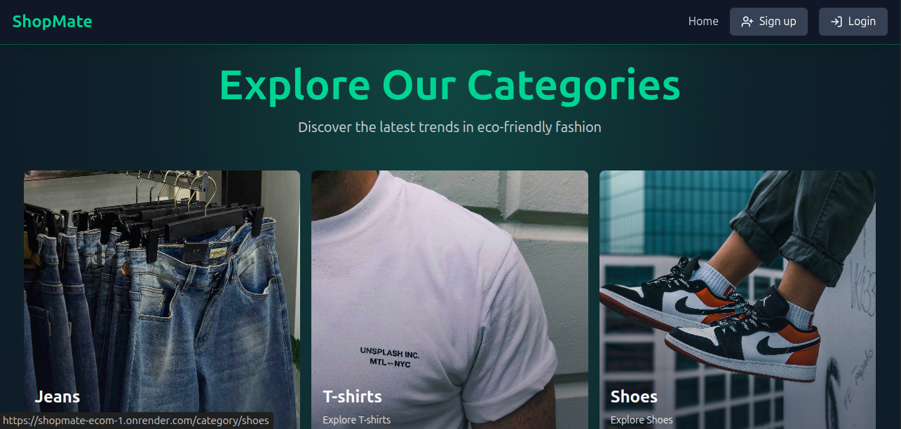

<!-- ## Setup Instructions

### 1. Create a `.env` file in the root directory and add the following:
```env
PORT=5000
MONGO_URI=your_mongo_uri

UPSTASH_REDIS_URL=your_redis_url

ACCESS_TOKEN_SECRET=your_access_token_secret
REFRESH_TOKEN_SECRET=your_refresh_token_secret

CLOUDINARY_CLOUD_NAME=your_cloud_name
CLOUDINARY_API_KEY=your_api_key
CLOUDINARY_API_SECRET=your_api_secret

STRIPE_SECRET_KEY=your_stripe_secret_key
CLIENT_URL=http://localhost:5173
NODE_ENV=development
```

### Run this app locally
```npm run build```

### Start the server
```npm run start```

### Start locally
```npm run dev```


 -->


# 🛒 E-Commerce Website

A full-stack e-commerce platform built with the **MERN stack**, featuring secure authentication, admin dashboard, Stripe integration, and Redis caching.  
Deployed on **Render**.

---

## 🚀 Features

### 👨‍💻 Admin
- Add, delete, and feature products.  
- Featured products are cached in **Redis** for fast retrieval.  
- View analytics of revenue and sales in numbers.  
- Track last 7 days’ sales with a dynamic graph.  

### 🛍️ User
- Sign up and sign in with **JWT authentication** (Access Token: 15 min, Refresh Token: 7 days).  
- Browse products, add to cart, and proceed to checkout.  
- Orders above ₹2000 generate a **10% discount coupon** for the next purchase.  
- Seamless session handling using **Axios interceptors** (auto token refresh).  
- Secure payment with **Stripe Payment Gateway**, including success and failure pages.  

---

## 🛠️ Tech Stack

- **Frontend:** React.js, Zustand, Axios  
- **Backend:** Node.js, Express.js, MongoDB  
- **Authentication:** JWT (Access + Refresh Tokens)  
- **Caching & Token Storage:** Redis  
- **Payment:** Stripe  
- **Deployment:** Render  

---

## 📂 Project Structure

/frontend → React frontend (Zustand for state management)
/backend → Express backend (MongoDB, Redis, Stripe, JWT)

---

## 📊 Screenshots

### Home Page
(./assets/cart.png)

### Cart


### Admin Dashboard


### Checkout Flow


### Purchase Success 


## ⚡ Installation & Setup

1. **Clone the repo**
   ```bash
   git clone https://github.com/therahul94/shopmate-ecom.git
   cd shopmate-ecom
   ```

2. **Setup .env file**
    ```env
        PORT=5000
        MONGO_URI=your_mongo_uri

        UPSTASH_REDIS_URL=your_redis_url

        ACCESS_TOKEN_SECRET=your_access_token_secret
        REFRESH_TOKEN_SECRET=your_refresh_token_secret

        CLOUDINARY_CLOUD_NAME=your_cloud_name
        CLOUDINARY_API_KEY=your_api_key
        CLOUDINARY_API_SECRET=your_api_secret

        STRIPE_SECRET_KEY=your_stripe_secret_key
        CLIENT_URL=http://localhost:5173
        NODE_ENV=development
    ```

3. **Run this app locally**
    ```npm run build```

4. **Start the server**
    ```npm run start```

5. **Start locally**
    ```npm run dev```

6. **🔗 Live Demo**

    👉 https://shopmate-ecom-1.onrender.com/


